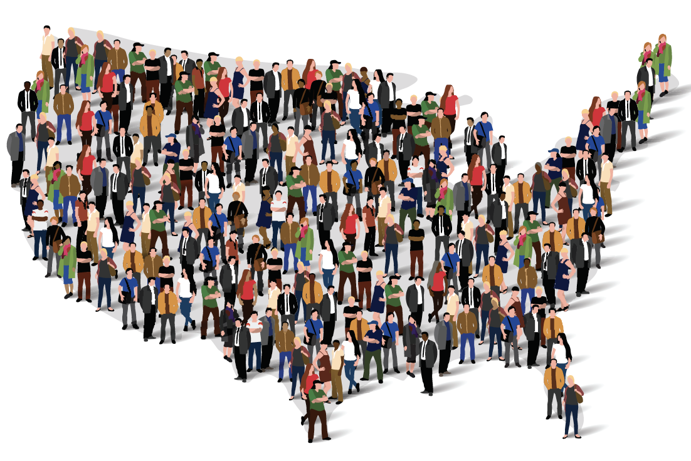

# Overview
Data visualization is an important mode of analysis and communication today, particularly for investigating and conveying information about society and social change. This course will focus on using the R statistical programming language to analyze and visualize social change over time using individual-level data from the United States Census (1870-2010). Through this practice, you will become very familiar with a large and versatile source of data (the [Integrated Public Use Microdata Series](http://usa.ipums.org)) and learn critical approaches to working with data that you can apply to other data sets as well. We will examine why and how the data were produced, what material effect they had and continue to have on the world, what information we can glean through their analysis, and how to visually represent various kinds of historical change, such as race formation, internal and international migration, and industrialization. Assignments will give you practice not only with data management, analysis, and visualization, but also with communicating your analysis, results, and interpretation in writing.

This course fulfils the **Domestic Diversity** requirement. We will analyze census data to understand the historical processes involved in producing and challenging social inequality along the axes of race, gender, class, and sexuality. Most assignments will require that you grapple with at least one of these dimensions of diversity.

This course also fulfils the **Quantitative Literacy** requirement. You will gain competency and comfort in working with numerical data and evaluating arguments made on the basis of numerical data. By using historical data to explore social change, you will learn to generate and communicate arguments about numerical data collected to investigate U.S. society.

# Course Outcomes
Assuming that you attend class regularly, complete required readings, and submit assignments on time, you can expect to be able to do the following by the end of the quarter:  

- Use R to organize, analyze, and visualize individual-level historical census data.  
- Communicate in writing about data analysis and visualization, from methods to results.  
- Explain changes over time in the information collected by the census and how those changes relate to historical events and policy debates in U.S. history.  
- Synthesize individual-level census data with information about the census to develop and communicate arguments about social change and social inequality.  

# Course Structure
This course will combine lecture, discussion, and hands-on practice with data analysis and visualization. All coding will be done in JupyterHub, a cloud-based environment that you can access with a browser from any internet-enabled device. Please bring your device to class.

# Readings
Readings should be completed before class on the day noted in the course schedule. You do not need to purchase any books for this class: all readings are linked from the schedule, but most links will only work if you are on campus or connected through [VPN](https://www.library.ucdavis.edu/service/connect-from-off-campus/). Readings listed as "Reference" may be helpful but are not required. These are from [R for Data Science](https://r4ds.had.co.nz/) by Garrett Grolemund and Hadley Wickham.

# Assignments and Grading
This course involves a total of 10 weekly lab assignments. The first nine are due on Tuesday in weeks 2-10; the last one is due at the time of our final exam. These will take the form of Jupyter notebooks, and will involve writing code to organize, analyze, and visualize data, and writing text to communcate your methods and findings. Each of these is worth 10 points. I will drop your lowest lab score (even if it is a 10) and replace it with your attendance and participation score (1 point per week). The course is worth a total of 100 points, and grades will be assigned as follows: A+[100,97), A[97,93), A-[93,90), B+[90,87), B[87,83), B-[83,80), C+[80,77), C[77,73), C-[73,70), D+[70,67), D[67,63), D-[63,60), F[60,0]

